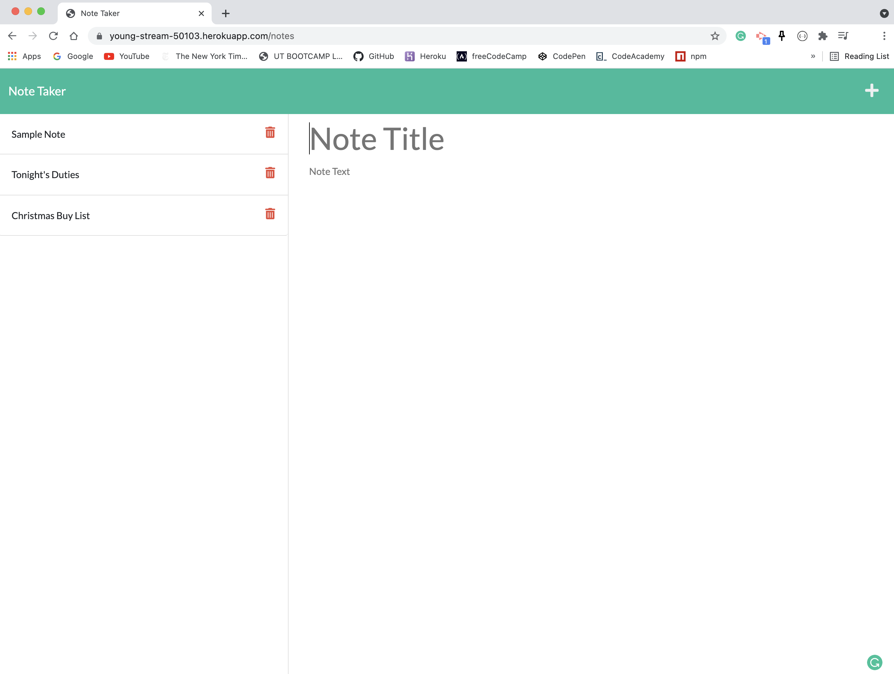
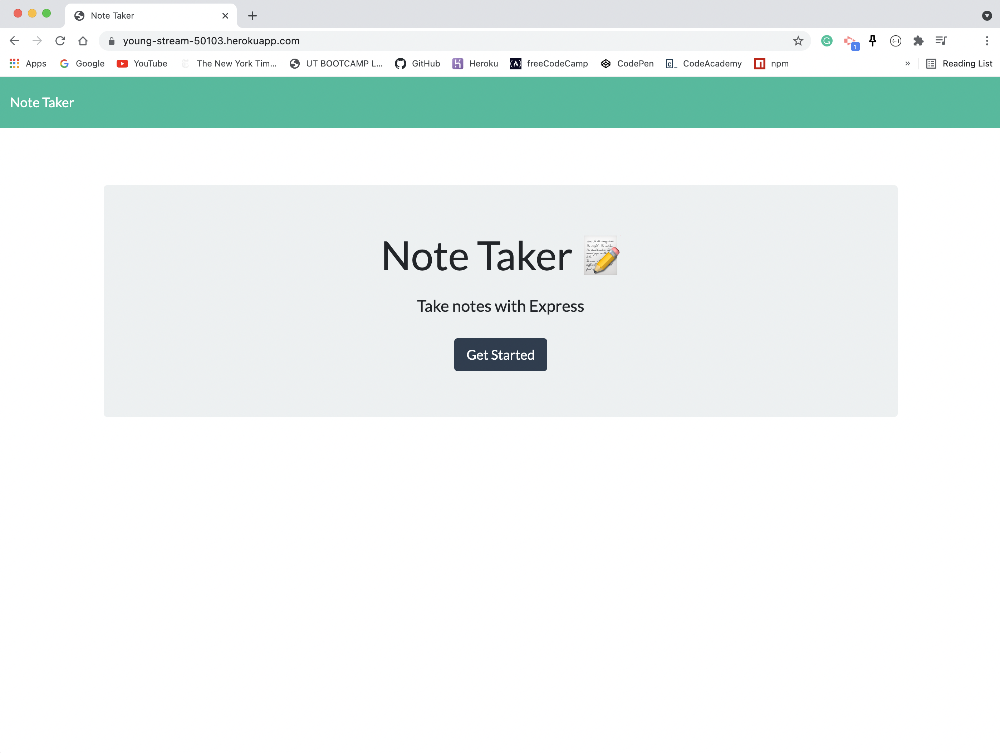
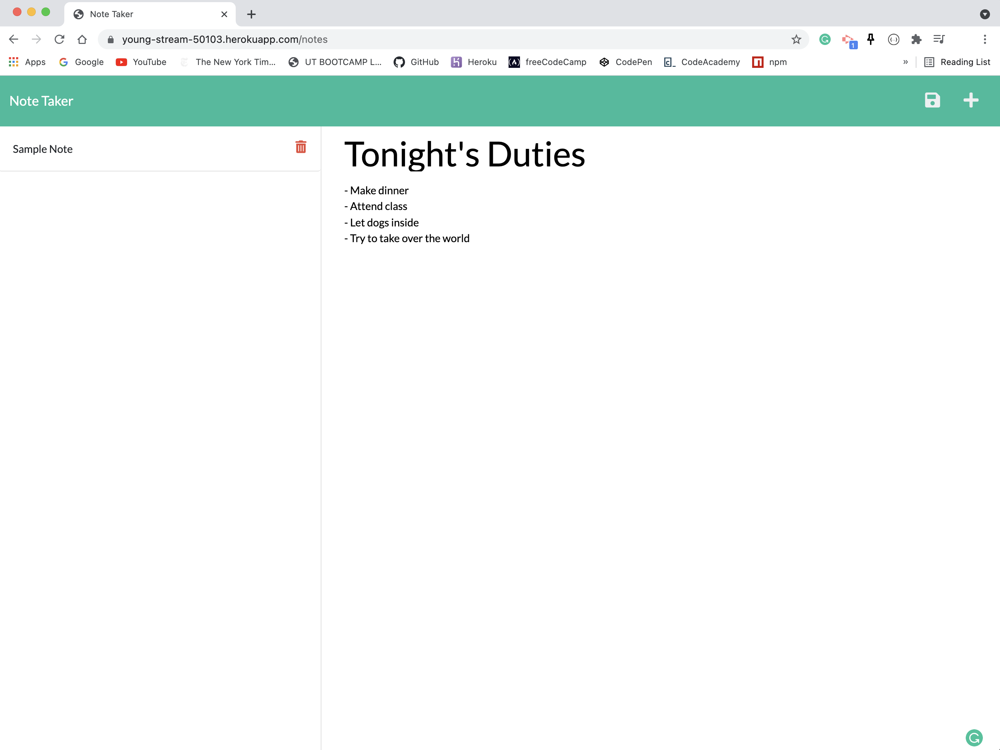
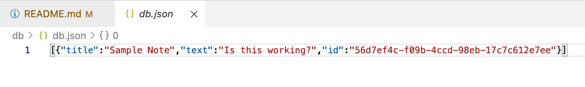

# Note Taker

Deployed Heroku URL - https://young-stream-50103.herokuapp.com/

## Description
Note Taker is a web application that allows you to type and save your notes - whether it is to keep track of tasks needed to completed or to organize personal thoughts. This application is beneficial to everyone from small business owners, busy students, or someone who just wants a great note taker!

Users are first greeted with the Note Taker landing page. When clicking on the 'Get Started' button, they are presented to the main page where they are free to see the sample note page on the left-hand column where existing saved notes will be visible. The right-hand column demonstrates empty fields to enter a new note's title and the respective test below. 

When text content is filled out, the Save icon will be visible and the user's note will be saved when it is clicked on and will appear in the left-hand column with other notes. When a visible, saved note is clicked on, it will be visible on the right-hand column. To delete notes, the user can click the trash can icon next to their saved note. If the user wishes to type another note, they can click on the + icon above at the top of the page where they will be allowed to type another note. 

## Table of Contents
- [Description](#Description)
- [Installation](#Installation)
- [Usage](#Usage)
- [Developed With](#Developed-with)

## Installation
- This file can be cloned through GitHub using the above Code button.
- Node.js, Express.js, and the UUID npm package are required prior to starting the localhost server in overviewing the application. 
- Insomnia is also required to check the localhost server and to ensure the application is running okay.

## Usage
- The URL of the functional, deployed application.
https://young-stream-50103.herokuapp.com/

- The URL of the GitHub repository. 
https://github.com/trujilml/note-taker

## Developed With 
- The UUID npm package used for creating a unique id for the saved note on the user's device and is presented through the db.json file when ran within the localhost on Insomnia - https://www.npmjs.com/package/uuid
- Example of the UUID generating a unique ID with a saved sample note

- Express.js - Back-end development, retrieves the save data of the notes through db.json and is responsible for the launch of the web server.
- Node.js  - Back-end development 
- Insomnia - Application used for testing the localhost server of this application, ensured the web application worked and proved its success for saving and deleting notes respectively. 
- Heroku - Cloud platform used to deploy this application 
- JavaScript - Front-end development
- HTML - Front-end development
- CSS - Front-end development

